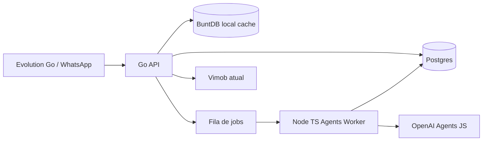

# Roadmap do Backend de Chatbots

## Diagnostico

O Vimob hoje funciona como app Lovable/Vite com Supabase e Edge Functions. Isso nao e ruim, mas para atendimento com agentes, WhatsApp e processamento assincrono, faz sentido criar um backend separado para reduzir acoplamento e proteger o produto atual.

## Arquitetura recomendada

## Fase 1

- Criar backend Go separado.
- Receber webhooks de WhatsApp.
- Persistir mensagens e estado em Postgres.
- Usar goroutines para processamento inicial.
- Usar BuntDB apenas para cache local rapido.
- Nao alterar rotas nem build do Lovable.

## Fase 2

- Criar worker Node TypeScript.
- Usar `@openai/agents`.
- Persistir `last_response_id` por conversa.
- Enviar `previousResponseId` no turno seguinte.
- Nao usar sandbox de agentes.
- Criar handoff humano e trilha de auditoria.

## Observacao sobre BuntDB

BuntDB e excelente como banco embutido rapido em Go, com TTL e persistencia local. Para escalar horizontalmente com varios containers, ele nao substitui Redis/Valkey ou uma fila compartilhada, porque cada instancia tera seu proprio arquivo/cache local.
